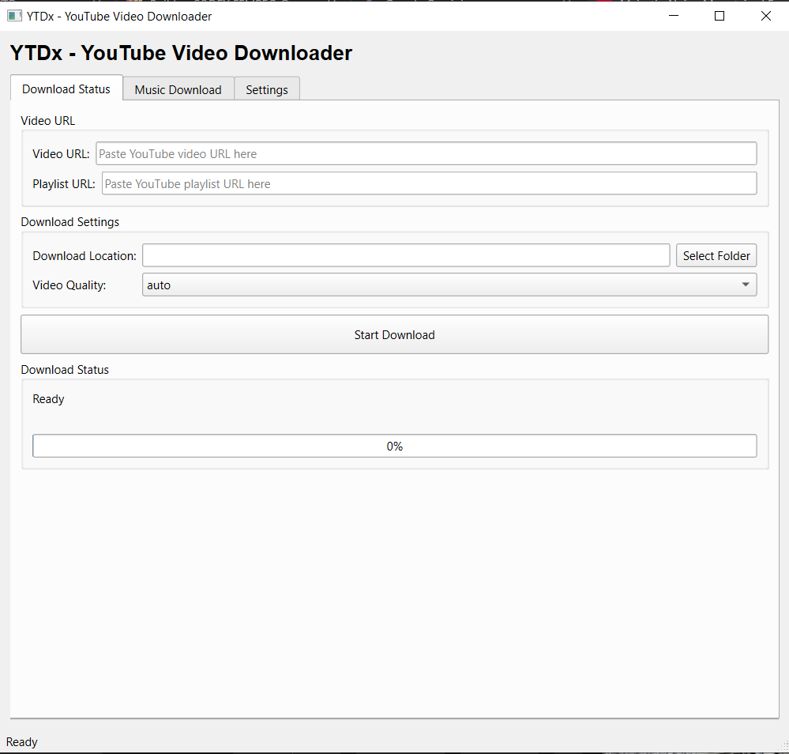
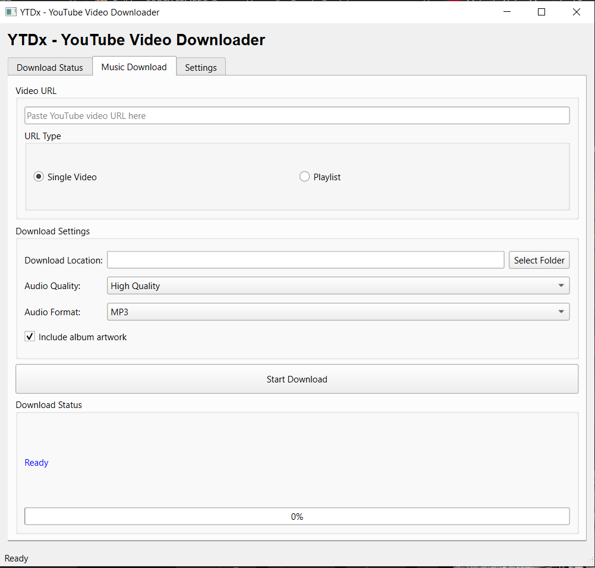
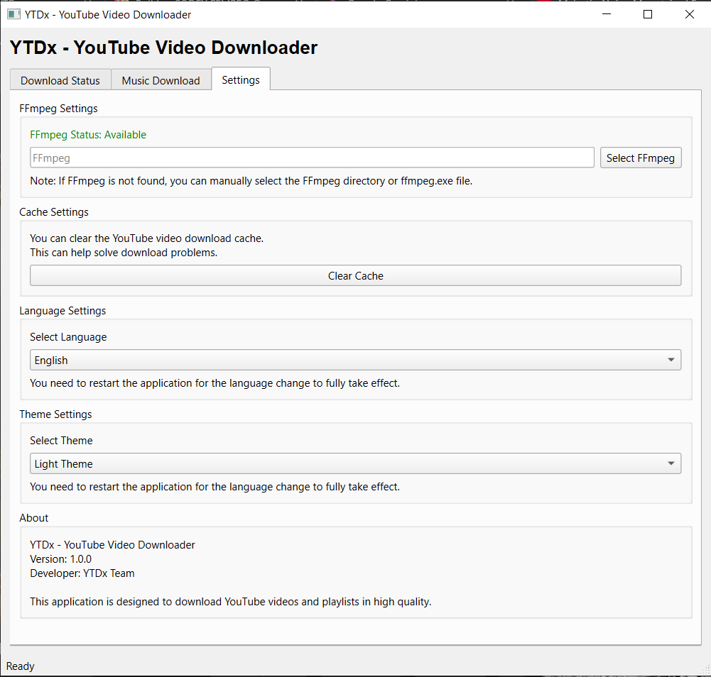

<div align="center">
  
# 📺 YTDx - Professional YouTube Downloader

### 🚀 High Quality Video & Music Downloader with FFmpeg Integration

<br/>

[](https://github.com/AllLiveSupport/YTDx-Youtube-Downloader/stargazers)
[](LICENSE)
[](https://www.python.org/)
[](https://buymeacoffee.com/alllivesupport)

<br/>


---

**✨ 4K/8K Support • 🎵 MP3/M4A with Metadata • 📋 Playlist Support • 🌍 Multi-Language**

</div>

<br/>

---

## 📸 Screenshots

<div align="center">
  
  
  
</div>

<br/>

---

## 🌟 Key Features

- **📺 High Quality Video**: Download videos in 1080p, 2K, 4K, and even 8K (uses FFmpeg to merge video+audio).
- **🎵 Music Downloader**: Convert videos to MP3 or M4A with high bitrate.
- **🖼️ Smart Metadata**: Automatically adds cover art (thumbnail), artist, and title tags to music files.
- **📋 Playlist Support**: Download single videos or entire playlists with one click.
- **🌍 Multi-Language Intelligence**: Fully localized for 4 languages:
  - 🇹🇷 Turkish (Türkçe)
  - 🇺🇸 English
  - 🇪🇸 Spanish (Español)
  - 🇷🇺 Russian (Pусский)
- **🧹 Storage Management**: Built-in `pytubefix` cache clearing tool to fix throttling issues.
- **🌗 Theme Support**: Toggle between Modern Dark and Light themes.

<br/>

---

## 🚀 Installation & Setup

### 1️⃣ Download & Install Requirements

First, clone the project and install the necessary Python libraries:

```bash
git clone https://github.com/AllLiveSupport/YTDx-Youtube-Downloader.git
cd YTDx-Youtube-Downloader
pip install -r requirements.txt
```

### 2️⃣ FFmpeg Installation (Critical for High Quality)

For 1080p+ video and proper audio conversion, **FFmpeg** is required.

**Step-by-Step Guide:**

1.  **Download FFmpeg:**
    - Go to [ffmpeg.org/download](https://ffmpeg.org/download.html) and download a build for Windows (e.g., from gyan.dev).
2.  **Extract:**
    - Extract the downloaded ZIP file.
    - Rename the folder to `ffmpeg` and move it to `C:\`.
    - You should have `C:\ffmpeg\bin\ffmpeg.exe`.
3.  **Add to Path (Automatic Command):**
    - Open **CMD** (Command Prompt) as **Administrator**.
    - Run the following command to permanently add FFmpeg to your system PATH:

    ```cmd
    setx /M PATH "%PATH%;C:\ffmpeg\bin"
    ```

    > **Note:** Access is denied errors? Make sure to run CMD as **Administrator**.

<br/>

---

## 🎮 Usage

### Video Mode
1.  Paste a YouTube Video or Playlist URL.
2.  Select your desired resolution (e.g., 1080p, 4K).
3.  Choose destination folder.
4.  Click **Download**.

### Audio Mode
1.  Switch to the **Music** tab.
2.  Paste URL.
3.  Select Format (MP3 / M4A) and Quality.
4.  If downloading a playlist, check "Playlist Download".
5.  Click **Download**. *The app will automatically tag files with covers!*

<br/>

---

## 📂 Project Structure

```bash
📦 YTDx
 ┣ 📂 docs/images         # Screenshots
 ┣ 📂 languages           # Translation Files (JSON)
 ┣ 📂 src                 # Source Code
 ┃ ┣ 📜 downloader.py     # Core Downloading Logic
 ┃ ┣ 📜 gui.py            # PyQt6 Interface
 ┃ ┗ 📜 language.py       # Localization Manager
 ┣ 📜 main.py             # Entry Point
 ┣ 📜 requirements.txt    # Python Dependencies
 ┗ 📜 README.md           # This File
```

<br/>

---

<div align="center">

### ⭐ Star this repo if you like it!

<br/>

[](https://github.com/AllLiveSupport)

</div>
